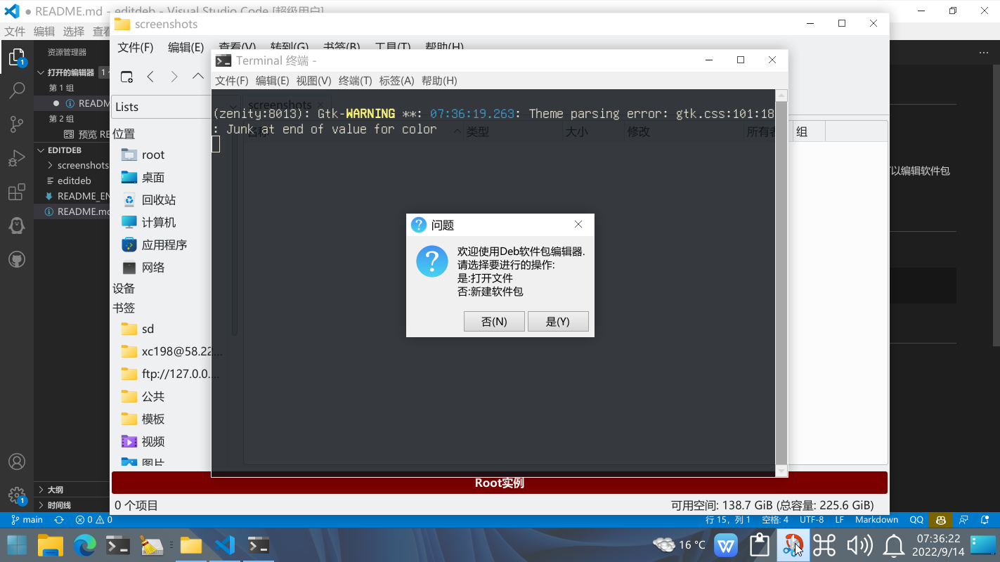
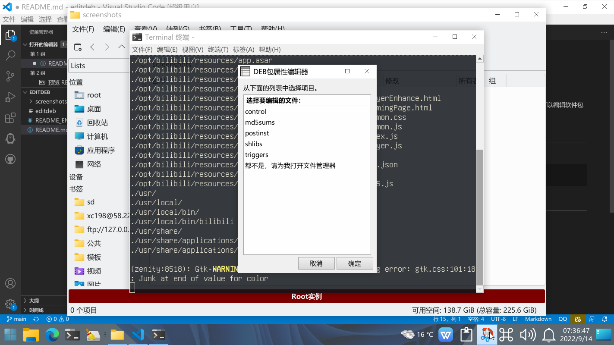
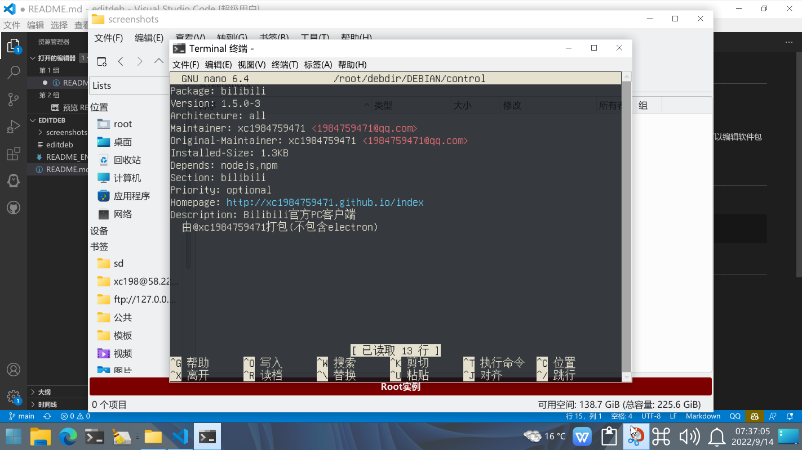
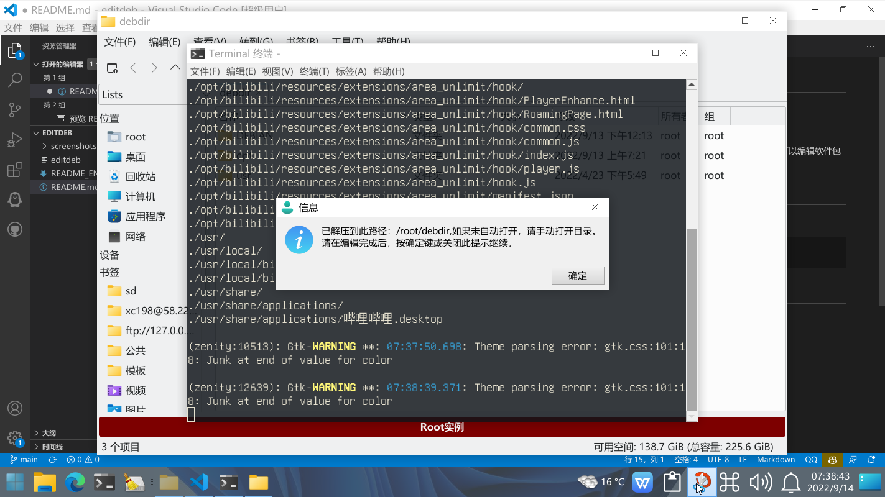
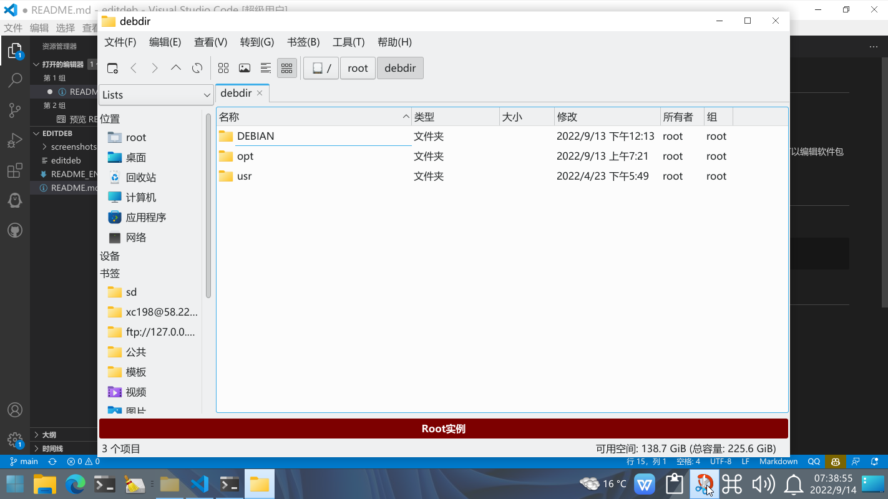

# editdeb
Editdeb,the DEB Package editor.Deb软件包编辑器.

中文 | <a href="README_EN.md" target="_blank">English</a>

本工具是一款可以用于编辑Debian软件包的脚本,您可以编辑软件包中的一切内容,包括文件列表以及控制文件等.

# 使用方法

命令行使用:
```bash
editdeb [Deb软件包路径]
```
# 截图





# 使用的项目
**zenity:一款开源的shell对话框引擎.http://live.gnome.org/Zenity**

**exo-utils:xfce4默认程序设置的基础组件.https://docs.xfce.org/xfce/exo/start**

**dpkg:Debian软件包管理程序.https://wiki.debian.org/Teams/Dpkg**

# 版权声明
