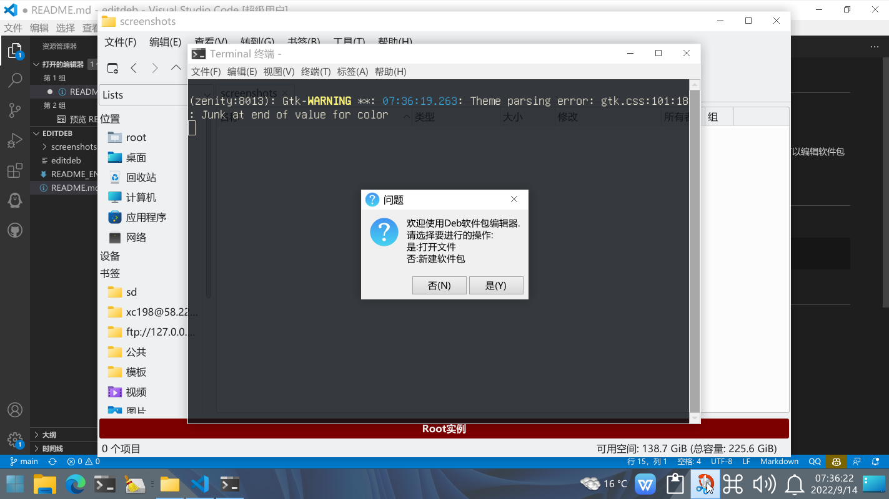
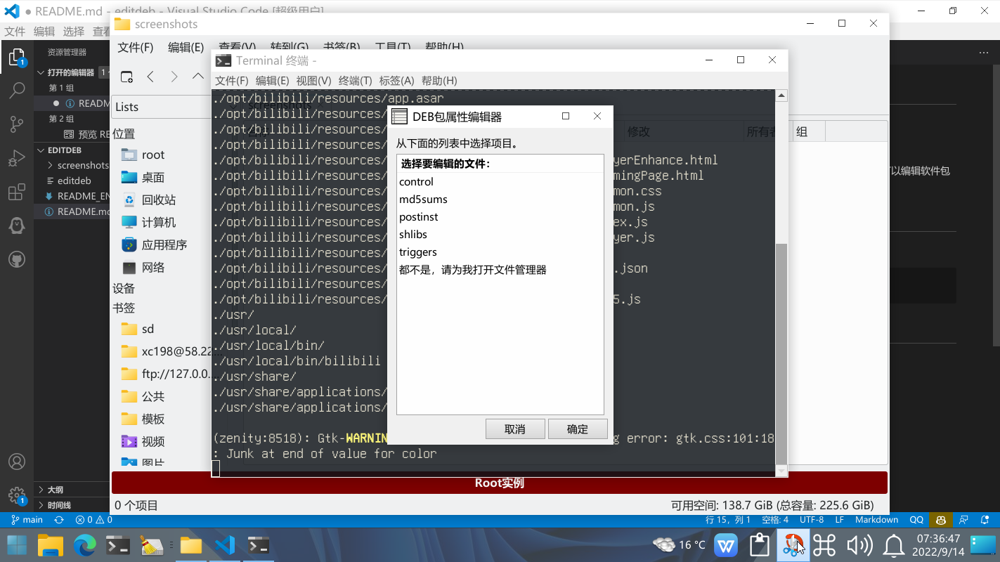
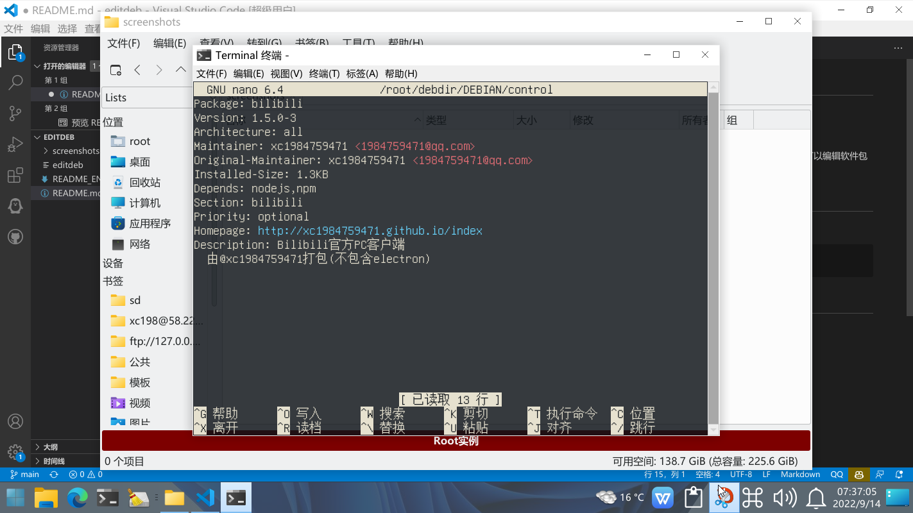
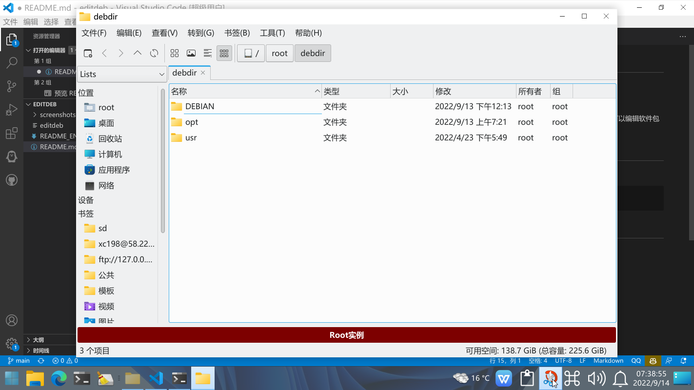

# editdeb
Editdeb,the DEB Package editor.Deb软件包编辑器.

<a href="README.md" target="_blank">中文</a> | English

This tool is a script that can be used to edit Debian packages. You can edit everything in the package, including file lists and control files.

# Usage
Command-Line:
```bash
editdeb [Deb package path]
```
# Screenshots





# Items to use
**zenity: An open source shell dialog engine. http://live.gnome.org/Zenity**

**exo-utils: Basic components of xfce4 to manage default application settings. https://docs.xfce.org/xfce/exo/start**

**dpkg: Debian Package Manager. https://wiki.debian.org/Teams/Dpkg**

# Copyright and Legal Notices
This project complies with the GPLv2 agreement, which can be viewed by <a href="LICENSE" target="_blank">click here</a>

The software package you edit may have closed-source commercial software, please be sure to abide by the relevant copyright license statement and legal regulations before editing. If legal problems are caused by the use of this software, the consequences will be borne by yourself, and this project will not assume any responsibility.